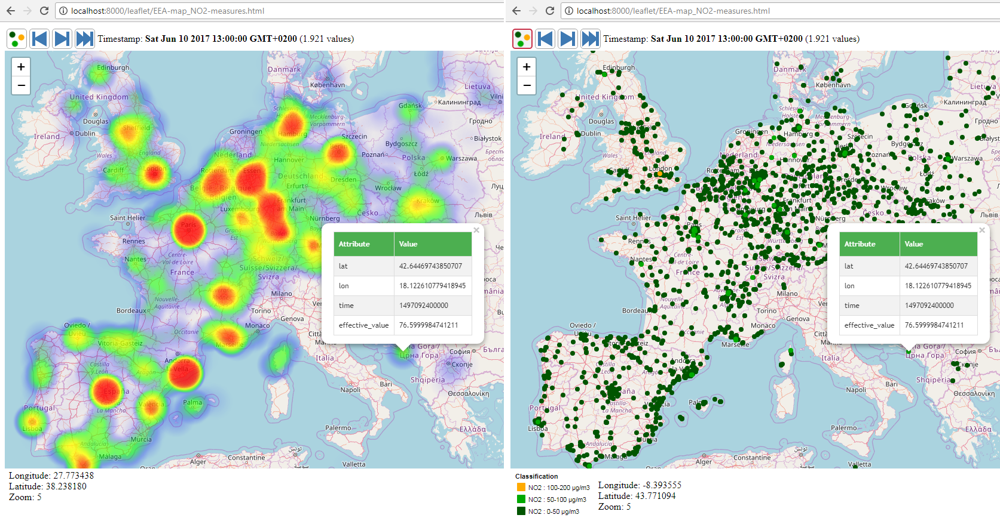

This repo consists of two components created to minimize the response size of WFS requests. 

This experimental software is part of a test of integration of a Big Spatial Data platform (Hadoop, HBase, GeoWave and GeoServer).

## WPS PackageFeatures module
It is a GeoServer WPS module to package features of a Vector Layer, or a SimpleFeatureCollection, to a binary stream.
It minimizes the size of the response compressing the feature information as far as possible.

## Web Map tester
Web Mapping client using Leaflet to test the 'PackageFeatures' module. The map gets the features using the
current map bounds and executing a WPS request.

The application draws the features in a Heatmap, or drawing the points with a ramp color.

